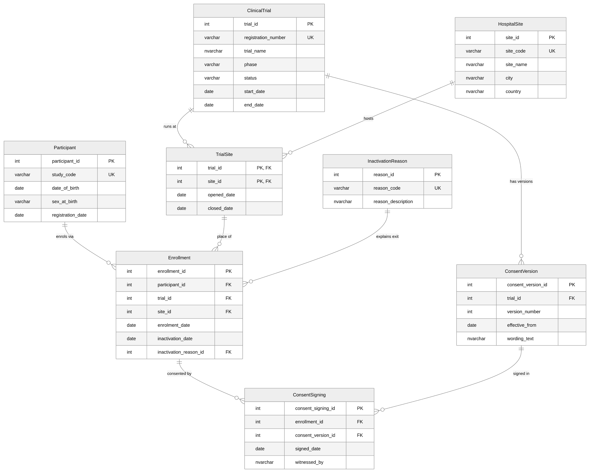
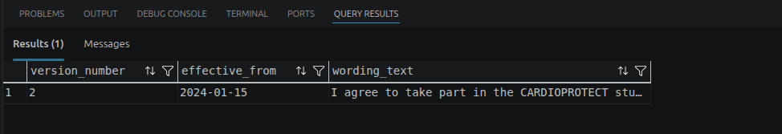
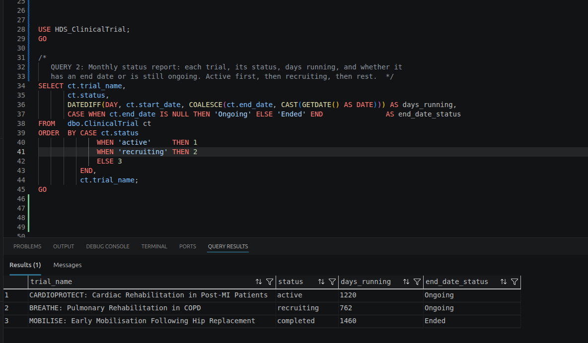
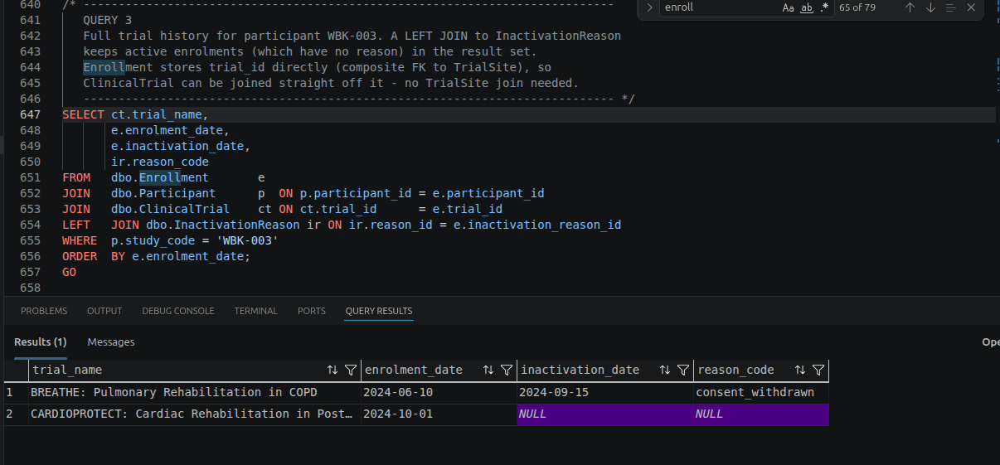
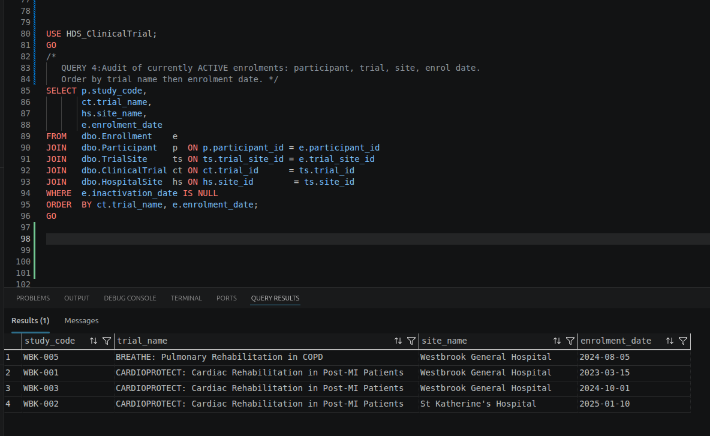
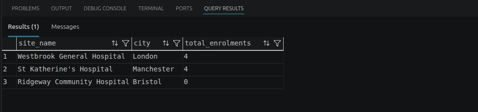
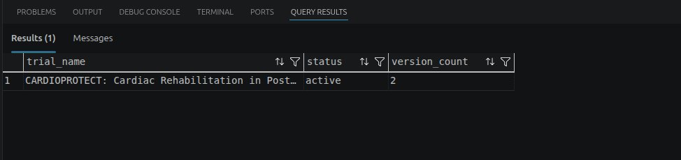
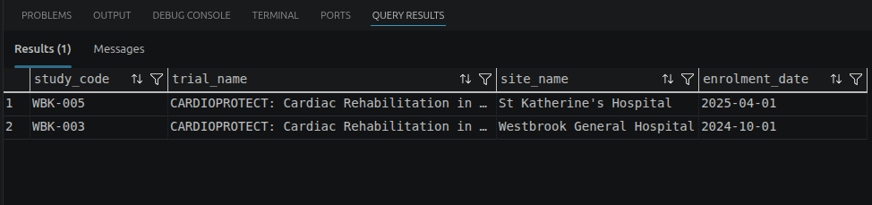

# Introduction {.unnumbered}

This report designs a fictional relational database for the Westbrook University Hospitals
NHS Trust Clinical Trial Participant Registry. It implements it in a Microsoft SQL
Server (T-SQL), populates it and answers seven fictional clinical questions. The
accompanying runnable script is `script/HDS_DB_LAINSBURY_2026.sql`.

::: callout-note
**Reproducing the results.** Run `script/HDS_DB_LAINSBURY_2026.sql`. It the requested
single self-contained script that creates the database, tables, data, trigger
and queries in order. It ran on my instance without errors from start to finish. Each
query returns one result grid that are screenshotted below. I used the VS Code mssql
extension connected to a local SQL Server.
:::



# Part 1: Database Design

## Entity Relationship Diagram

The DB schema has eight tables. `TrialSite` is necessary addition that resolves the many-to-many relationship between trials and sites. `Enrollment` records a participant's participation in a
trial at a site. `ConsentSigning` is the append-only log of consent events to ensure a complete audit trail. The ERD is shown in crow's-foot notation in @fig-erd.

{#fig-erd width=100%}

## Table Descriptions

Every table uses a surrogate `INT IDENTITY` primary key for internal
joins, plus one or more **business UNIQUE keys** for the values
clinical staff actually recognise.

| Table | Purpose and key design choices |
|:------|:-------------------------------------------------------------------------------|
| **ClinicalTrial** | One row per trial. PK `trial_id` (IDENTITY). UNIQUE `registration_number` --- the ISRCTN number is the externally recognised, never-reused identifier, so it is the natural key. `CHECK` on `phase` (I/II/III/IV) and `status` enforce the controlled vocabularies; `CHECK (end_date >= start_date)` prevents impossible ranges. |
| **HospitalSite** | One row per site. PK `site_id`. UNIQUE `site_code` --- short codes (e.g. `WBK-GEN`) are how sites are referred to operationally, so they form the natural key. |
| **Participant** | One pseudonymised participant per row; **no names held**. PK `participant_id`. UNIQUE `study_code` --- the pseudonym is the only safe external identifier. `CHECK` on `sex_at_birth` (biological sex at birth, not gender identity --- only two values are recorded); `CHECK (date_of_birth < registration_date)`. |
| **InactivationReason** | Controlled vocabulary of reasons a participant leaves a trial, so exits report consistently across trials. PK `reason_id`. UNIQUE `reason_code` --- the stable report token. |
| **TrialSite** | **Link table** resolving the trial--site many-to-many; also records when each site opened/closed for recruitment on that trial. Composite PK `(trial_id, site_id)` --- the pairing itself is the row's identity, so no surrogate IDENTITY column is used here (unlike every other table); FKs to ClinicalTrial and HospitalSite; `CHECK (closed_date >= opened_date)`. |
| **ConsentVersion** | Every approved version of a trial's consent form, including wording and effective date; old versions never overwritten. PK `consent_version_id`. `UNIQUE (trial_id, version_number)`; FK to ClinicalTrial; `wording_text` is `NVARCHAR(MAX)`. |
| **Enrollment** | A participant enrolled in a trial at a specific site. Carries `(trial_id, site_id)` as a composite FK straight to `TrialSite`, so trial **and** site are captured together and a participant can only enrol where the trial actually runs. Exit is recorded without deleting the row. PK `enrollment_id`; FKs to Participant, TrialSite (composite), InactivationReason; `UNIQUE (participant_id, trial_id, site_id)`; paired-null `CHECK`; filtered unique index for "one active trial at a time". |
| **ConsentSigning** | Append-only log of every consent signing event: when, which version, who witnessed. PK `consent_signing_id`; FKs to Enrollment and ConsentVersion; `UNIQUE (enrollment_id, consent_version_id)`; protected by an append-only trigger. |

: Table descriptions and key design choices {tbl-colwidths="[22,78]"}

**Check constraints.** 

* Phase/status/sex use `CHECK ... IN (...)` to guarantee
clean categorical data for cross-trial reporting. 

* Date checks (`end_date >= start_date`, `closed_date >= opened_date`,
`inactivation_date >= enrolment_date`) prevent logically impossible records. 

* The paired-null check on `Enrollment` guarantees a leaving date never appears without
a reason and vice-versa.

## NULL and NOT NULL Decisions

| Column | Decision | Rationale |
|:-----------------------|:---------|:------------------------------------------------|
| `ClinicalTrial.end_date` | NULL | NULL is meaningful: the trial is still running. Current trials have no end date *yet*. |
| `ClinicalTrial.start_date`, `status`, `phase` | NOT NULL | A trial cannot exist without these. |
| `TrialSite.closed_date` | NULL | The site can still be open for recruitment on that trial. |
| `Enrollment.inactivation_date`, `inactivation_reason_id` | NULL (paired) | The classic "meaningful absence". The paired-null `CHECK` keeps them in step. |
| `Participant.date_of_birth`, `registration_date`, `sex_at_birth` | NOT NULL | Required for eligibility, age and demographic reporting. |
| `ConsentSigning.signed_date`, `witnessed_by` | NOT NULL | A consent event without a date or witness is not a valid consent event. |
| `ConsentVersion.wording_text`, `effective_from` | NOT NULL | A consent version is meaningless without its wording and the date it took effect. |

: Nullability decisions and their justification {tbl-colwidths="[37,10,53]"}

## Relationships Between Tables

| Tables | Type / FK | What it represents |
|:--------------------------------|:-----------------------------------|:----------------------|
| ClinicalTrial -- HospitalSite | M:N via `TrialSite` (FK `trial_id`, `site_id`) | A trial runs at many sites and a site hosts many trials. The link table also carries the open/close recruitment dates. |
| ClinicalTrial -> ConsentVersion | 1:M (FK `trial_id`) | One trial accumulates many consent-form versions over its life as the protocol changes. |
| Participant -> Enrollment | 1:M (FK `participant_id`) | A participant may have several enrolments over time, only one active at once as defined per brief (filtered index). |
| TrialSite -> Enrollment | 1:M (composite FK `trial_id, site_id`) | Each enrolment happens at exactly one trial-site pairing that the `TrialSite` link table confirms actually exists. |
| InactivationReason -> Enrollment | 1:M optional (FK `inactivation_reason_id`) | A standardised reason classifies many exits; active enrolments reference none. |
| Enrollment -> ConsentSigning | 1:M (FK `enrollment_id`) | One enrolment can have several signing events (original + re-consent after amendment). |
| ConsentVersion -> ConsentSigning | 1:M (FK `consent_version_id`) | Each signing records which version was signed; one version is signed by many participants. |

: Relationships between tables {tbl-colwidths="[27,33,40]"}

**Many-to-many resolution.** The only many-to-many relationship (ClinicalTrial
-- HospitalSite) is resolved with the `TrialSite` junction table. I decided to use a composite
primary key `(trial_id, site_id)`. Therefore no surrogate is needed since the pairing itself is the row's identity.



# Part 2: SQL

## INSERT statements

Every INSERT that needs to reference another table (e.g. Enrollment needs a trial_id) looks up the ID up by a human-recognisable business key instead of hardcoding the raw number. There are no
hard-coded IDENTITY integers to avoid mistakes. 

::: callout-note
 I have only shown the first insert per table in this report to illustrate the pattern. All INSERTs are in `script/HDS_DB_LAINSBURY_2026.sql`.
:::

**ClinicalTrial**

```sql
INSERT INTO dbo.ClinicalTrial (registration_number, trial_name, phase, status, start_date, end_date)
VALUES ('ISRCTN10234567', N'CARDIOPROTECT: Cardiac Rehabilitation in Post-MI Patients',
        'III', 'active', '2023-03-01', NULL);
```

**HospitalSite**

```sql
INSERT INTO dbo.HospitalSite (site_code, site_name, city, country)
VALUES ('WBK-GEN', N'Westbrook General Hospital', N'London', N'England');
```

**Participant**

```sql
INSERT INTO dbo.Participant (study_code, date_of_birth, sex_at_birth, registration_date)
VALUES ('WBK-001', '1958-04-12', 'Male', '2021-11-03');
```




**InactivationReason**

```sql
INSERT INTO dbo.InactivationReason (reason_code, reason_description)
VALUES ('consent_withdrawn', N'Participant withdrew their consent to take part in the trial');
```

**TrialSite** (FK look-ups via subquery)

```sql
INSERT INTO dbo.TrialSite (trial_id, site_id, opened_date, closed_date)
VALUES (
 (SELECT trial_id FROM dbo.ClinicalTrial WHERE registration_number='ISRCTN10234567'),
 (SELECT site_id  FROM dbo.HospitalSite  WHERE site_code='WBK-GEN'),
 '2023-03-01', NULL);
```

**ConsentVersion**

```sql
INSERT INTO dbo.ConsentVersion (trial_id, version_number, effective_from, wording_text)
VALUES (
 (SELECT trial_id FROM dbo.ClinicalTrial WHERE registration_number='ISRCTN10234567'),
 1, '2023-03-01',
 N'I agree to take part in the CARDIOPROTECT study. ... I may withdraw at any time without affecting my medical care.');
```

**Enrollment** (resolves trial_id and site_id directly from business keys)

```sql
INSERT INTO dbo.Enrollment (participant_id, trial_id, site_id, enrolment_date, inactivation_date, inactivation_reason_id)
VALUES (
 (SELECT participant_id FROM dbo.Participant   WHERE study_code='WBK-001'),
 (SELECT trial_id       FROM dbo.ClinicalTrial WHERE registration_number='ISRCTN10234567'),
 (SELECT site_id        FROM dbo.HospitalSite  WHERE site_code='WBK-GEN'),
 '2023-03-15', NULL, NULL);
```



**ConsentSigning** (resolves enrolment + version by business keys)

```sql
INSERT INTO dbo.ConsentSigning (enrollment_id, consent_version_id, signed_date, witnessed_by)
VALUES (
 (SELECT e.enrollment_id FROM dbo.Enrollment e
    JOIN dbo.Participant p ON p.participant_id = e.participant_id
    JOIN dbo.ClinicalTrial ct ON ct.trial_id = e.trial_id
    WHERE p.study_code='WBK-001' AND ct.registration_number='ISRCTN10234567'),
 (SELECT cv.consent_version_id FROM dbo.ConsentVersion cv
    JOIN dbo.ClinicalTrial ct ON ct.trial_id = cv.trial_id
    WHERE ct.registration_number='ISRCTN10234567' AND cv.version_number=1),
 '2023-03-15', N'Nurse A. Okafor');
```



## SQL Queries

### Query 1: Current consent wording for CARDIOPROTECT

**Clinical question.** Before a consent discussion, a research nurse needs the
current (most recently effective) consent wording for CARDIOPROTECT: version
number, effective date, and full wording.

```sql
SELECT TOP (1) cv.version_number, cv.effective_from, cv.wording_text
FROM   dbo.ConsentVersion cv
JOIN   dbo.ClinicalTrial  ct ON ct.trial_id = cv.trial_id
WHERE  ct.trial_name LIKE 'CARDIOPROTECT%'
ORDER  BY cv.effective_from DESC;
```

**Screenshot.**

{width=100%}


**Discussion.** The query filters to CARDIOPROTECT, orders versions by
`effective_from` descending and keeps the top row, so it always returns the
latest version even after future amendments. *Data quality:* it relies on
`effective_from` being accurate, a new version entered with a wrong or missing
effective date could show the nurse out-of-date wording.

### Query 2: Monthly trial status report

**Clinical question.** A summary of each trial, its status, how long it has run
in days, and whether it has an end date or is ongoing; active trials first, then
recruiting, then the rest.

```sql
SELECT ct.trial_name, ct.status,
       DATEDIFF(DAY, ct.start_date, COALESCE(ct.end_date, CAST(GETDATE() AS DATE))) AS days_running,
       CASE WHEN ct.end_date IS NULL THEN 'Ongoing' ELSE 'Ended' END AS end_date_status
FROM   dbo.ClinicalTrial ct
ORDER  BY CASE ct.status WHEN 'active' THEN 1 WHEN 'recruiting' THEN 2 ELSE 3 END,
          ct.trial_name;
```

**Screenshot.**

{width=100%}


**Discussion.** `COALESCE` substitutes today's date for trials with no end date
so "days running" is meaningful for ongoing trials, and a `CASE` expression in
`ORDER BY` gives the custom status priority. *Data quality:* "days running" for
ongoing trials changes every day the report is run, so it is only a dated
snapshot.

### Query 3: Trial history for participant WBK-003

**Clinical question.** Full history for WBK-003: every trial, enrolment date,
inactivation date, and reason code; ordered by enrolment date. Active enrolments
have no reason.

```sql
SELECT ct.trial_name, e.enrolment_date, e.inactivation_date, ir.reason_code
FROM   dbo.Enrollment       e
JOIN   dbo.Participant      p  ON p.participant_id = e.participant_id
JOIN   dbo.ClinicalTrial    ct ON ct.trial_id      = e.trial_id
LEFT   JOIN dbo.InactivationReason ir ON ir.reason_id = e.inactivation_reason_id
WHERE  p.study_code = 'WBK-003'
ORDER  BY e.enrolment_date;
```

**Screenshot.**

{width=100%}


**Discussion.** A `LEFT JOIN` to `InactivationReason` is essential: an active
enrolment has a NULL reason and an INNER join would silently drop it. `Enrollment`
stores `trial_id` directly (as part of its composite FK to `TrialSite`), so
`ClinicalTrial` is joined straight off it with no `TrialSite` hop needed. 

*Data quality:* a participant who left but whose `inactivation_reason_id` was never
populated would show a leaving date with a blank reason, the paired-null check
constraint I entered in the table prevents this.

### Query 4: Audit of currently active enrolments

**Clinical question.** Each currently **active** participant with their trial,
site, and enrolment date; ordered by trial name then enrolment date.

```sql
SELECT p.study_code, ct.trial_name, hs.site_name, e.enrolment_date
FROM   dbo.Enrollment    e
JOIN   dbo.Participant   p  ON p.participant_id = e.participant_id
JOIN   dbo.ClinicalTrial ct ON ct.trial_id      = e.trial_id
JOIN   dbo.HospitalSite  hs ON hs.site_id       = e.site_id
WHERE  e.inactivation_date IS NULL
ORDER  BY ct.trial_name, e.enrolment_date;
```

**Screenshot.**

{width=100%}


**Discussion.** "Active" is expressed as `inactivation_date IS NULL`. `Enrollment`
stores `trial_id` and `site_id` directly, so `ClinicalTrial` and `HospitalSite`
are joined straight off it, no `TrialSite` hop needed to reconstruct where
each active participant sits. 

*Data quality:* the definition of "active" depends on inactivation being recorded promptly. A participant who has left but whose exit was not entered would wrongly appear here.

### Query 5: Enrolment count per site (including empty sites)

**Clinical question.** How many participants have ever been enrolled at each
site, including sites with none. Show site name, city, total count, descending.

```sql
SELECT hs.site_name, hs.city, COUNT(e.enrollment_id) AS total_enrolments
FROM   dbo.HospitalSite hs
LEFT   JOIN dbo.Enrollment e ON e.site_id = hs.site_id
GROUP  BY hs.site_name, hs.city
ORDER  BY total_enrolments DESC;
```

**Screenshot.**

{width=100%}


**Discussion.** Starting from `HospitalSite` with a `LEFT JOIN` preserves sites
with no enrolments, and `COUNT(e.enrollment_id)` counts rows rather than NULLs so
empty sites correctly score 0. `Enrollment` stores `site_id` directly, so it is
joined straight off `HospitalSite` with no `TrialSite` hop needed. 

*Data quality:* A site that participates in a trial but has not yet recorded any
enrolments is indistinguishable from one that genuinely has none, the zero needs interpretation in context.

### Query 6: Trials with an amended protocol

**Clinical question.** Trials where the protocol was amended (more than one
consent version): trial name, current status, number of versions; descending;
only where more than one version exists.

```sql
SELECT ct.trial_name, ct.status, COUNT(cv.consent_version_id) AS version_count
FROM   dbo.ClinicalTrial  ct
JOIN   dbo.ConsentVersion cv ON cv.trial_id = ct.trial_id
GROUP  BY ct.trial_name, ct.status
HAVING COUNT(cv.consent_version_id) > 1
ORDER  BY version_count DESC;
```

**Screenshot.**

{width=100%}


**Discussion.** Grouping by trial and counting versions, then filtering with
`HAVING COUNT(...) > 1`, isolates amended trials (`HAVING` filters the aggregate, which `WHERE` cannot).

*Data quality:* this counts version *rows*, so a duplicate version entered in error would overstate the number of genuine amendments.

### Query 7: Most recently enrolled participant per site

**Clinical question.** The most recently enrolled participant at each site across
all trials: study code, trial name, site name, enrolment date.

```sql
WITH RankedEnrolments AS (
    SELECT p.study_code, ct.trial_name, hs.site_name, e.enrolment_date,
           ROW_NUMBER() OVER (PARTITION BY hs.site_id
                              ORDER BY e.enrolment_date DESC, e.enrollment_id DESC) AS rn
    FROM   dbo.Enrollment    e
    JOIN   dbo.Participant   p  ON p.participant_id = e.participant_id
    JOIN   dbo.ClinicalTrial ct ON ct.trial_id      = e.trial_id
    JOIN   dbo.HospitalSite  hs ON hs.site_id       = e.site_id
)
SELECT study_code, trial_name, site_name, enrolment_date
FROM   RankedEnrolments
WHERE  rn = 1
ORDER  BY site_name;
```

**Screenshot.**

{width=100%}


**Discussion.** `ROW_NUMBER()` partitioned by site and ordered by enrolment date descending ranks each site's enrolments; keeping `rn = 1` returns the newest per site, with `enrollment_id` as a deterministic tie-breaker. `Enrollment` stores `trial_id` and `site_id` directly, so `ClinicalTrial` and `HospitalSite` are joined straight off it with no `TrialSite` hop needed. 

*Data quality:* if two participants share the same enrolment date the tie-break is arbitrary, so "most
recent" may need a finer timestamp than a date to be unambiguous.



# Part 3: Reflection

## Why no participant names?

Storing only a `study_code` pseudonymises the registry. This follows the data-minimisation principle from the GDPR *Principles relating to processing of personal data* (GDPR Article 5(1)(c))[@art5gdpr].Additional, we could also refer to the Caldicott Principles [@caldicott] of justifying every use of confidential information and using the minimum necessary which reinforces the article 5 of the GDPR. This means a breach of the trial database would not directly expose personal identities and personal identities does not bring necessary information to the database to justify their inclusion. 

Direct identifiers such as names would live in a separate, access-controlled master linkage list held by the research office. Researchers can query and report entirely on `study_code`, so trial analyses can be shared more freely because they carry no personal identifiers. The cost is friction and a dependency on the linkage to the access-controlled master linkage list: a broken or out-of-date mapping could mean a participant cannot be reached for a safety issue. The design therefore trades day-to-day convenience for a much stronger confidentiality and information-governance position.

## A situation where the data could mislead

Consider Query 4 and Query 5, which both depend on `inactivation_date`. If a
participant has actually left a trial but their exit has not yet been entered,
they will still appear as "active" and will be counted in active-enrolment
reports --- overstating recruitment and potentially prompting unnecessary
follow-up contact. The data is not *wrong* field by field; it is *stale*, which
is harder to spot. A data manager could detect this by reconciling the registry
against source records: cross-checking active enrolments against clinic
attendance or against the standardised `InactivationReason` log, and flagging
participants with no recent activity (e.g. no consent or visit events for an
unusually long period) for review. Preventively, they could add a periodic
data-quality report listing long-inactive "active" enrolments, set a service
standard for how quickly exits must be recorded, and use the `lost_to_follow_up`
reason code consistently so genuine non-contact is captured rather than left as a
silent gap. The fix is process plus monitoring, not just a query.

## Why consent records are append-only, and how to enforce it

Consent records are the legal and ethical evidence that each participant agreed
to the specific protocol version in force **at the time**. They must be append-only
because consent is a historical fact. This requires trial-critical records to carry a complete, tamper-evident audit trail, and editing or deleting a signing event would destroy the evidence that regulators,sponsors and ethics committees rely on to prove valid consent existed. If the rule were broken, a re-consent after a protocol amendment could be silently overwritten or a withdrawn consent erased, making it impossible to demonstrate which wording a participant actually agreed to and
undermining every downstream analysis that assumes valid consent.

I enforced this at the database level with an **`INSTEAD OF UPDATE, DELETE`
trigger** on `ConsentSigning` that rejects any such operation with an error,
while leaving `INSERT` free (see `script/HDS_DB_LAINSBURY_2026.sql`).This guarantees the rule regardless of which application or user connects, which
a permission grant alone would not. 

```sql
CREATE OR ALTER TRIGGER dbo.trg_ConsentSigning_AppendOnly
ON dbo.ConsentSigning
INSTEAD OF UPDATE, DELETE
AS
BEGIN
    SET NOCOUNT ON;
    THROW 51000, 'ConsentSigning is append-only: rows cannot be updated or deleted.', 1;
END;
```




# Reference

# Appendix A --- Data dictionary {.unnumbered}

A complete column-level reference for every table, derived from the
`CREATE TABLE` section of `script/HDS_DB_LAINSBURY_2026.sql`. *Key:* PK = primary
key, FK = foreign key, UK = unique (business) key. All surrogate `*_id` keys are
`INT IDENTITY(1,1)`.

This dictionary is not static documentation: the metadata section of
`script/HDS_DB_LAINSBURY_2026.sql` stores every table description --- and the
column descriptions where meaning is not
self-evident, in particular the meaningful-NULL columns --- **in the database
catalog itself** as `MS_Description` extended properties. The dictionary can
therefore be regenerated at any time (or consumed by data-catalogue tooling) by
querying the system views, so the metadata travels with the schema rather than
living in a document that can drift out of date:

```sql
SELECT t.name                                        AS table_name,
       c.name                                        AS column_name,
       TYPE_NAME(c.user_type_id)                     AS data_type,
       IIF(c.is_nullable = 1, 'NULL', 'NOT NULL')    AS nullability,
       CAST(ep.value AS NVARCHAR(400))               AS column_description
FROM   sys.tables  t
JOIN   sys.columns c ON c.object_id = t.object_id
LEFT   JOIN sys.extended_properties ep
       ON  ep.major_id = c.object_id AND ep.minor_id = c.column_id
       AND ep.class = 1 AND ep.name = 'MS_Description'
ORDER  BY t.name, c.column_id;
```

```{=latex}
\footnotesize
```

## ClinicalTrial {.unnumbered}

| Column | Type | Null | Key | Notes |
|:------------------|:------------|:---------|:---|:------------------------------|
| `trial_id` | INT IDENTITY | NOT NULL | PK | Surrogate primary key. |
| `registration_number` | VARCHAR(20) | NOT NULL | UK | ISRCTN number; externally recognised natural key. |
| `trial_name` | NVARCHAR(150) | NOT NULL | | Full trial title. |
| `phase` | VARCHAR(4) | NOT NULL | | `CHECK` IN ('I','II','III','IV'). |
| `status` | VARCHAR(20) | NOT NULL | | `CHECK` IN ('recruiting','active','completed','suspended'). |
| `start_date` | DATE | NOT NULL | | Trial start date. |
| `end_date` | DATE | NULL | | NULL = ongoing. `CHECK (end_date >= start_date)`. |

: ClinicalTrial {tbl-colwidths="[24,16,11,6,43]"}

## HospitalSite {.unnumbered}

| Column | Type | Null | Key | Notes |
|:------------|:------------|:---------|:---|:----------------------------------|
| `site_id` | INT IDENTITY | NOT NULL | PK | Surrogate primary key. |
| `site_code` | VARCHAR(10) | NOT NULL | UK | Short operational code, e.g. `WBK-GEN`. |
| `site_name` | NVARCHAR(100) | NOT NULL | | Hospital site name. |
| `city` | NVARCHAR(60) | NOT NULL | | City. |
| `country` | NVARCHAR(60) | NOT NULL | | Country. |

: HospitalSite {tbl-colwidths="[20,16,11,6,47]"}

## Participant {.unnumbered}

| Column | Type | Null | Key | Notes |
|:--------------------|:------------|:---------|:---|:--------------------------------|
| `participant_id` | INT IDENTITY | NOT NULL | PK | Surrogate primary key. |
| `study_code` | VARCHAR(15) | NOT NULL | UK | Pseudonym; only external identifier (no names held). |
| `date_of_birth` | DATE | NOT NULL | | `CHECK (date_of_birth < registration_date)`. |
| `sex_at_birth` | VARCHAR(10) | NOT NULL | | `CHECK` IN ('Male','Female'). Records biological sex at birth, not gender identity --- only two values are captured for this field. |
| `registration_date` | DATE | NOT NULL | | Date first registered with the research office. |

: Participant {tbl-colwidths="[24,15,11,6,44]"}

## InactivationReason {.unnumbered}

| Column | Type | Null | Key | Notes |
|:---------------------|:-------------|:---------|:---|:------------------------------|
| `reason_id` | INT IDENTITY | NOT NULL | PK | Surrogate primary key. |
| `reason_code` | VARCHAR(30) | NOT NULL | UK | Standardised report token, e.g. `consent_withdrawn`. |
| `reason_description` | NVARCHAR(255) | NOT NULL | | Human-readable description of the reason. |

: InactivationReason {tbl-colwidths="[26,16,11,6,41]"}

## TrialSite (link table) {.unnumbered}

| Column | Type | Null | Key | Notes |
|:----------------|:------------|:---------|:------|:---------------------------|
| `trial_id` | INT | NOT NULL | PK, FK | -> `ClinicalTrial`. Part of the composite PK `(trial_id, site_id)`. |
| `site_id` | INT | NOT NULL | PK, FK | -> `HospitalSite`. Part of the composite PK `(trial_id, site_id)`. |
| `opened_date` | DATE | NOT NULL | | Date the site opened for recruitment on this trial. |
| `closed_date` | DATE | NULL | | NULL = still open. `CHECK (closed_date >= opened_date)`. |

: TrialSite. The only table in the schema without a surrogate IDENTITY key --- the `(trial_id, site_id)` pairing is itself the row's identity. {tbl-colwidths="[20,13,11,9,47]"}

## ConsentVersion {.unnumbered}

| Column | Type | Null | Key | Notes |
|:---------------------|:-------------|:---------|:------|:---------------------------|
| `consent_version_id` | INT IDENTITY | NOT NULL | PK | Surrogate primary key. |
| `trial_id` | INT | NOT NULL | FK, UK | -> `ClinicalTrial`. Part of `UNIQUE (trial_id, version_number)`. |
| `version_number` | INT | NOT NULL | UK | `CHECK (version_number > 0)`. Part of the unique key. |
| `effective_from` | DATE | NOT NULL | | Date this version came into effect. |
| `wording_text` | NVARCHAR(MAX) | NOT NULL | | Full consent-form wording; never overwritten. |

: ConsentVersion {tbl-colwidths="[26,15,11,9,39]"}

## Enrollment {.unnumbered}

| Column | Type | Null | Key | Notes |
|:-------------------------|:-----------|:---------|:------|:-----------------------|
| `enrollment_id` | INT IDENTITY | NOT NULL | PK | Surrogate primary key. |
| `participant_id` | INT | NOT NULL | FK, UK | -> `Participant`. Part of `UNIQUE (participant_id, trial_id, site_id)`. |
| `trial_id` | INT | NOT NULL | FK, UK | Composite FK with `site_id` -> `TrialSite` (confirms the site actually runs the trial). Part of the unique key. |
| `site_id` | INT | NOT NULL | FK, UK | Composite FK with `trial_id` -> `TrialSite`. Part of the unique key. |
| `enrolment_date` | DATE | NOT NULL | | Date enrolment began. |
| `inactivation_date` | DATE | NULL | | NULL = still active. `CHECK (inactivation_date >= enrolment_date)`. |
| `inactivation_reason_id` | INT | NULL | FK | -> `InactivationReason`. Paired-null `CHECK` with `inactivation_date`. |

: Enrollment. A filtered unique index allows only one active enrolment per participant (`WHERE inactivation_date IS NULL`). {tbl-colwidths="[27,12,10,8,43]"}

## ConsentSigning (append-only) {.unnumbered}

| Column | Type | Null | Key | Notes |
|:---------------------|:-------------|:---------|:------|:--------------------------|
| `consent_signing_id` | INT IDENTITY | NOT NULL | PK | Surrogate primary key. |
| `enrollment_id` | INT | NOT NULL | FK, UK | -> `Enrollment`. Part of `UNIQUE (enrollment_id, consent_version_id)`. |
| `consent_version_id` | INT | NOT NULL | FK, UK | -> `ConsentVersion`. Part of the unique key. |
| `signed_date` | DATE | NOT NULL | | Date the consent was signed. |
| `witnessed_by` | NVARCHAR(100) | NOT NULL | | Name/role of the witnessing staff member. |

: ConsentSigning. Protected by an `INSTEAD OF UPDATE, DELETE` trigger so rows can only ever be inserted. {tbl-colwidths="[26,14,10,8,42]"}

```{=latex}
\normalsize
```



# Appendix B --- File manifest {.unnumbered}

The submission is a single, self-contained script, run top to bottom:

| Section (in run order) | Contents |
|:-----------------------------------------|:---------------------------------------|
| Create database | (Re)creates the `HDS_ClinicalTrial` database |
| Create tables | `CREATE TABLE`s, constraints, indexes |
| Insert reference data | The five reference sheets from the brief |
| Insert additional operational data | `TrialSite`, `Enrollment`, `ConsentSigning` data |
| Append-only trigger | `INSTEAD OF UPDATE, DELETE` enforcement on `ConsentSigning` |
| Queries | The seven queries |
| Metadata | Extended-property metadata + catalog-driven data dictionary |

: `script/HDS_DB_LAINSBURY_2026.sql` --- section contents in run order



# Appendix C --- Interoperability mapping (HL7 FHIR) {.unnumbered}

The registry does not exist in isolation: if the trust later needs to exchange
trial data with other NHS organisations, sponsors, or national research
platforms, the natural target is the HL7 FHIR standard used across the NHS.
The schema maps cleanly onto FHIR resources, which validates the entity
choices and gives a ready-made route for future data linkage beyond the trust:

| Registry table | FHIR resource | Notes |
|:---------------|:--------------|:--------------------------------------------|
| `ClinicalTrial` | `ResearchStudy` | Phase and status map to the resource's `phase` and `status` elements. |
| `Participant` | `Patient` (pseudonymised) | `study_code` becomes a pseudonymous `identifier`; no name elements populated. |
| `Enrollment` | `ResearchSubject` | FHIR likewise links one patient to one study with period and status. |
| `HospitalSite` | `Location` / `Organization` | Site code as the `identifier`. |
| `ConsentSigning` + `ConsentVersion` | `Consent` | FHIR `Consent` also references the specific policy/form version agreed to. |
| `InactivationReason` | `ResearchSubject` progress reason (coded) | The controlled vocabulary would be published as a FHIR `CodeSystem`. |

: Mapping of registry tables to HL7 FHIR resources {tbl-colwidths="[22,26,52]"}



# Coversheet {.unnumbered}

## MSt Healthcare Data Science --- Authentication of practice {.unnumbered}

| I confirm that I have fully read and understood the assignment brief for this module. | **Y** |
|:---------------------------------------------------------------------------------|:------|

## Details {.unnumbered}

| | |
|:--------------------------------------------------------------------|:----------------|
| Name | Malik J. Lainsbury |
| Submission Date | 03 -- 07 -- 26 |
| Word Count: whole assignment including codes | ~2,900 word-equivalents (1,447 prose + 7 queries x 150 + 8 INSERT statements x 50) |
| Word Count: main body excluding abstract, references and supplementary materials | 1,447 prose words (appendices excluded as supplementary) |

## Permission to share your assignment {.unnumbered}

**I do give permission to share my assignment with future MSt participants.**

## University statement of originality {.unnumbered}

This assignment is the result of my own work and includes nothing which is the
outcome of work done in collaboration except as declared in the Preface and
specified in the text. It is not substantially the same as any that I have
previously submitted for a degree or diploma or other qualification at the
University of Cambridge or any other university or similar institution, or that
is being concurrently submitted, except as declared in the Preface and specific
in the text. I further state that no substantial part of my Portfolio has
already been submitted, nor is being concurrently submitted for any such
degree, diploma or other qualification at the University of Cambridge or any
other university or similar institution except as declared in the Preface and
specified in the text.

| I confirm the statement of originality as above | **Y** |
|:------------------------------------------------|:------|

## Questions for reflection {.unnumbered}

**1. Which aspects of this assignment are you most uncertain about and/or would
most like to receive feedback on?** Whether giving `Enrollment` a composite FK
`(trial_id, site_id)` straight to `TrialSite` (rather than a single surrogate
`trial_site_id` pointer) is considered good practice or over-normalisation; and
whether the filtered unique index is an acceptable way to express the "one
active trial at a time" rule.

**5. Using the wording in the rubric, how would you describe the quality of the
different aspects of your work?** The ERD, table descriptions and relationships
aim at the "high performance" descriptors: all entities identified, the
many-to-many resolved with a link table, and each decision justified against
the scenario. The script runs end-to-end without errors and every foreign key
is resolved by subquery on a business key.



# Appendix D --- Additional Operational Data {.unnumbered}

## Overview

Assignment section 6.1 specifies: "In addition to the reference data provided, you must also add **your own data** to all the other records you have designed and there should be **enough data of your own to answer all seven queries meaningfully**."

The reference data provided (ClinicalTrial, HospitalSite, InactivationReason, Participant, ConsentVersion) contains no `TrialSite`, `Enrollment`, or `ConsentSigning` rows at all --- those three tables are entirely self-authored operational data. Beyond the minimum needed to satisfy the six worked-example requirements, two further **trial transitions** were added to enrich Queries 4, 5 and 7. `TrialSite` uses a composite primary key `(trial_id, site_id)` rather than a surrogate IDENTITY (see Table Descriptions, main body); as a result `Enrollment` stores `trial_id` and `site_id` directly rather than a single `trial_site_id` pointer.

## Why a transition, not a second simultaneous enrolment

The schema enforces the brief's rule that a participant may be actively enrolled in only one trial at a time with a filtered unique index:

```sql
CREATE UNIQUE INDEX UX_Enrollment_OneActivePerParticipant
    ON dbo.Enrollment(participant_id)
    WHERE inactivation_date IS NULL;
```

This permits at most one row per participant with `inactivation_date IS NULL`. Consequently, the two additions below each **close** the participant's existing active enrolment first (an `UPDATE` in place, preserving the original row as the brief requires), then **insert** a new active enrolment --- exactly the "left a previous trial and later joined a new one" pattern the scenario itself describes.

## Additional Trial Transitions Added

### 1. WBK-002: CARDIOPROTECT (St Katherine's) closed, BREATHE (Reading Community) opened

**Data added:**
- `UPDATE`: WBK-002's active CARDIOPROTECT enrolment at St Katherine's is closed --- `inactivation_date = 2025-02-15`, `inactivation_reason_id` = `eligibility_lost`
- `INSERT`: new active enrolment --- BREATHE at Reading Community, `enrolment_date = 2025-03-01`
- `INSERT`: consent signing --- BREATHE v1, signed 2025-03-01, witnessed by Nurse S. Patel
- **Significance**: this is the first and only enrolment ever recorded at Reading Community, activating a previously empty site

**Impact on queries:**
- **Query 5**: Reading Community moves from 0 to 1 total enrolment --- all three sites now appear with a non-zero count, demonstrating the `LEFT JOIN` correctly includes a site the moment it gains its first enrolment
- **Query 4**: WBK-002 still appears (now under BREATHE/Reading Community instead of CARDIOPROTECT/St Katherine's) --- the active count is unchanged, but site/trial diversity increases
- **Query 7**: Reading Community now has a candidate row, so all three sites are represented in the "most recent per site" result

### 2. WBK-005: BREATHE (Westbrook General) closed, CARDIOPROTECT (St Katherine's) opened

**Data added:**
- `UPDATE`: WBK-005's active BREATHE enrolment at Westbrook General is closed --- `inactivation_date = 2025-03-15`, `inactivation_reason_id` = `clinician_decision`
- `INSERT`: new active enrolment --- CARDIOPROTECT at St Katherine's, `enrolment_date = 2025-04-01` (the most recent enrolment date in the whole database)
- `INSERT`: consent signing --- CARDIOPROTECT v2 (the current version), signed 2025-04-01, witnessed by Nurse A. Okafor

**Impact on queries:**
- **Query 7**: gives St Katherine's a genuine choice between two dated candidates (WBK-002's original 2025-01-10 enrolment and WBK-005's 2025-04-01 enrolment), so the `ROW_NUMBER() OVER (PARTITION BY site ...)` logic is doing real selection work rather than returning a trivial single-row partition
- **Query 4**: WBK-005 still appears (now under CARDIOPROTECT/St Katherine's instead of BREATHE/Westbrook General)

## Data Coverage Summary

| Metric | Before additions | After additions |
|:--------|:--------:|:--------:|
| Enrollment rows | 7 | 9 |
| Active enrolments | 4 | 4 (unchanged --- each transition closes one, opens one) |
| Hospital sites with $\geq$1 enrolment ever | 2 | 3 (Reading Community now included) |
| Consent signing events | 8 | 10 |
| Trials each active participant has moved between | 0 | 2 participants (WBK-002, WBK-005) demonstrate the "left one trial, joined another" pattern |

## Query 4, 5 and 7 results after the additions

**Query 4 (active enrolments, 4 rows):** WBK-002 / BREATHE / Reading Community / 2025-03-01; WBK-001 / CARDIOPROTECT / Westbrook General / 2023-03-15; WBK-003 / CARDIOPROTECT / Westbrook General / 2024-10-01; WBK-005 / CARDIOPROTECT / St Katherine's / 2025-04-01.

**Query 5 (enrolments per site, 3 rows):** Westbrook General 4; St Katherine's 4; Reading Community 1.

**Query 7 (most recent per site, 3 rows):** Reading Community --- WBK-002 / BREATHE / 2025-03-01; St Katherine's --- WBK-005 / CARDIOPROTECT / 2025-04-01; Westbrook General --- WBK-003 / CARDIOPROTECT / 2024-10-01.

