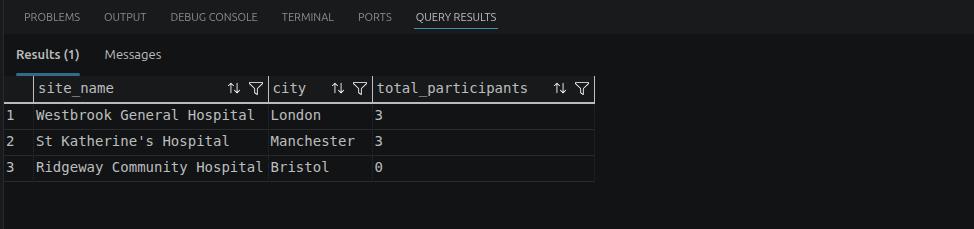

# Introduction {.unnumbered}

This report designs a fictional relational database (DB) for the Westbrook University Hospitals
NHS Trust Clinical Trial Participant Registry, implements it in Microsoft SQL Server (T-SQL),
populates it with fictional data and answers seven clinical questions via SQL queries.

::: callout-note
**Reproducing the results.** Please run `script/HDS_DB_LAINSBURY_2026.sql`. This is the requested
single self-contained script that creates the database, tables, data, trigger
and queries in order. It ran without errors from start to finish on my machine. Each query
returns one result grid, screenshotted below. I used VS Code with the mssql extension on a local
SQL Server.
:::



# Part 1: Database Design

## Entity Relationship Diagram

My database schema (dbo.) has eight tables: the five reference tables provided as .csv files, plus three of my own --- `TrialSite` resolves the trial-site many-to-many, `Enrollment` records a participant's participation in a trial at a site and `ConsentSigning` is the append-only audit log of consent events. The ERD is shown in crow's-foot notation in @fig-erd.

{#fig-erd width=100%}

## Table Design Choices

### Foreign and Unique Key Design Choices

Every table uses a surrogate `INT IDENTITY` primary key for internal
joins, plus one or more **UNIQUE keys (or business keys)** for the values clinical staff would actually recognise. 

Every foreign key targets the surrogate key, never the business key. This renders the inserts slightly more verbose but is a personal choice for data integrity and maintainability. This study uses externally issued codes such as the ISRCTN number. If they were to change, they can then be corrected in one parent row without cascading. The unique keys are used in INSERT look-up subqueries. In the real world, the business keys would be known to the data-entry staff and the look-ups would be hidden behind a user interface/form or via a staging table.

### Table Descriptions

| Table | Purpose and key design choices |
|:------|:-------------------------------------------------------------------------------|
| **ClinicalTrial** | One row per trial. PK `trial_id` (IDENTITY). UNIQUE `registration_number` (ISRCTN number) is the externally recognised natural key. Children reference `trial_id`, never the ISRCTN number. |
| **HospitalSite** | One row per site. PK `site_id`. UNIQUE `site_code` (e.g. `WBK-GEN`) are the operational natural key. Children reference `site_id`, never `site_code`. |
| **Participant** | One pseudonymised participant per row, **no names held**. PK `participant_id`. UNIQUE `study_code`, the pseudonym, is the only safe external identifier. `CHECK (date_of_birth < registration_date)`. `Enrollment` references `participant_id`, never the study code. |
| **InactivationReason** | Controlled vocabulary of reasons a participant leaves a trial, so exits report consistently across trials. PK `reason_id`. The UNIQUE `reason_code` is the stable report token. `Enrollment` references `reason_id`, so codes can be renamed safely. |
| **TrialSite** | **Link table** resolving the trial- site many-to-many. It also records when each site opened/closed for recruitment on that trial. I use a composite PK `(trial_id, site_id)`. The pairing is the row's identity, so no surrogate is used (unlike every other table). FKs to ClinicalTrial and HospitalSite. Both FKs reference the parents' surrogate keys. |
| **ConsentVersion** | Every approved version of a trial's consent form, including wording and effective date. Any old consent versions is never overwritten (under the principle of always add rather than overwrite). PK `consent_version_id`. `UNIQUE (trial_id, version_number)`. The FK references `trial_id`, not the ISRCTN number to follow the same design pattern as other tables. |
| **Enrollment** | A participant enrolled in a trial at a specific site. It carries `(trial_id, site_id)` as a composite FK straight to `TrialSite`, so trial **and** site are captured together and a participant can only enrol where the trial actually runs. The alternative --- a surrogate `trial_site_id` pointer --- would enforce the same rule but force every query to hop through `TrialSite`; storing the pair keeps enrolment rows self-describing without denormalising (the composite FK keeps the pair consistent). Exit is recorded without deleting the row. PK `enrollment_id`; FKs to Participant, TrialSite (composite), InactivationReason; `UNIQUE (participant_id, trial_id, site_id)`; paired-null `CHECK`. |
| **ConsentSigning** | Append-only log of every consent signing event: when, which version, who witnessed. PK `consent_signing_id`; FKs to Enrollment and ConsentVersion; `UNIQUE (enrollment_id, consent_version_id)`; protected by an append-only trigger. Both FKs reference surrogate keys. `CHECK` restricts `witnessed_by` to name characters (forename + surname). |

: Table descriptions and key design choices {tbl-colwidths="[22,78]"}

## Column Design Choices

### Column constraints 

* Phase/status/sex use `CHECK ... IN (...)` to force controlled vocabularies and
clean categorical data for reporting. **Caveat:** `sex_at_birth` is interpreted as biological sex at birth, not gender identity, and captures only two values to keep the schema simple; in a production DB this would be reviewed against best practice and local healthcare inclusivity guidance.

* I use date checks (`end_date >= start_date`, `closed_date >= opened_date`,
`inactivation_date >= enrolment_date`, `date_of_birth < registration_date`) throughout to prevent logically impossible records. The first three use `>=` because a same-day pair is legitimate; the birth-date check is deliberately strict (`<`) as a participant cannot register with the research office on or before the day they were born.

* A `CHECK (version_number > 0)` on `ConsentVersion` rejects zero or negative version numbers, keeping the version sequence meaningful.

* The paired-null check on `Enrollment` guarantees a leaving date never appears without a reason, and vice-versa.

* A `CHECK` restricts `witnessed_by` to name characters only (forename + surname). Names like José must be written as Jose.

* I used `NVARCHAR(MAX)` for consent wording because it can be long and multi-paragraph. The other text fields are sized to fit the expected content.

* A filtered unique index (UX_Enrollment_OneActivePerParticipant) on Enrollment.participant_id WHERE inactivation_date IS NULL enforces the business rule that a participant may be actively enrolled in only one trial at a time as requested in the brief. This allows unlimited historical enrolments while preventing concurrent participation.

* I added a trigger to enforce the append-only rule on ConsentSigning. It rejects any UPDATE or DELETE operation with a clear error message (51000), while leaving INSERT free. This guarantees the rule regardless of which application or user connects, which a permission grant alone would not.

### NULL and NOT NULL Decisions

The two tables below cover every column in the schema (IDENTITY primary keys, and `TrialSite`'s composite-PK columns, are NOT NULL by definition and are omitted).

| Table | Column | Rationale |
|:---------------|:------------------------|:-------------------------------------|
| ClinicalTrial | `end_date` | If NULL, the trial is still running. Current trials have no end date *yet*. |
| TrialSite | `closed_date` | The site can still be open for recruitment on that trial. |
| Enrollment | `inactivation_date`, `inactivation_reason_id` | This is a "meaningful absence": the participant is still active in the trial. The pair must be NULL (or populated) together therefore the paired-null `CHECK` keeps them in step. |

: Columns allowing NULL values {tbl-colwidths="[20,28,52]"}

| Table | Column | Rationale |
|:---------------|:------------------------|:-------------------------------------|
| ClinicalTrial | `start_date`, `status`, `phase` | A trial cannot exist without these columns populated. |
| TrialSite; Enrollment; ConsentVersion | `opened_date`; `enrolment_date`; `effective_from` | Every record's timeline must begin somewhere. Unlike their end-date partners above, an absent value would carry no meaning. |
| Participant | `date_of_birth`, `registration_date`, `sex_at_birth` | Required for eligibility, age and demographic reporting. |
| ConsentSigning | `signed_date`, `witnessed_by` | A consent event without a date or witness is not a valid consent event. |
| ConsentVersion | `wording_text` | A consent version is meaningless without its wording. |
| Enrollment; ConsentSigning; ConsentVersion | FK columns: `participant_id`, `trial_id`, `site_id`; `enrollment_id`, `consent_version_id`; `trial_id` | A child row cannot exist without its parents. Only exception is with `inactivation_reason_id`, the one deliberately nullable FK, paired with inactivation_date. |
| ClinicalTrial; HospitalSite; Participant; InactivationReason; ConsentVersion | Unique keys: `registration_number`; `site_code`; `study_code`; `reason_code`; `version_number` | These UNIQUE keys are the look-up targets of the INSERT subqueries. A NULL here would break that pattern and the insertion would fail. |
| ClinicalTrial; HospitalSite; InactivationReason | Descriptive fields: `trial_name`; `site_name`, `city`, `country`; `reason_description` | A reference row without its human-readable label is unusable in reports, it is a reporting requirement. |

: Columns strictly NOT NULL {tbl-colwidths="[20,28,52]"}

## Relationships Between Tables

| Tables | Type / FK | What it represents |
|:--------------------------------|:-----------------------------------|:----------------------|
| ClinicalTrial -- HospitalSite | M:N via `TrialSite` (FK `trial_id`, `site_id`) | A trial runs at many sites and a site hosts many trials. The link table also carries the open/close recruitment dates. |
| ClinicalTrial -> ConsentVersion | 1:M (FK `trial_id`) | One trial accumulates many consent-form versions over its life as the protocol changes. |
| Participant -> Enrollment | 1:M (FK `participant_id`) | A participant may have several enrolments over time, only one active at once as defined per brief (filtered index). |
| TrialSite -> Enrollment | 1:M (composite FK `trial_id, site_id`) | Each enrolment happens at exactly one trial-site pairing that the `TrialSite` link table confirms actually exists. |
| InactivationReason -> Enrollment | 1:M optional (FK `inactivation_reason_id`) | A standardised reason classifies many exits; active enrolments reference none. |
| Enrollment -> ConsentSigning | 1:M (FK `enrollment_id`) | One enrolment can have several signing events (original + re-consent after amendment). |
| ConsentVersion -> ConsentSigning | 1:M (FK `consent_version_id`) | Each signing records which version was signed; one version is signed by many participants. |

: Relationships between tables {tbl-colwidths="[27,33,40]"}

**Many-to-many resolution.** The only many-to-many relationship (ClinicalTrial - HospitalSite) is resolved with the `TrialSite` junction table, using the composite primary key `(trial_id, site_id)`. The pairing itself is the row's identity.



# Part 2: SQL

## INSERT statements

Every INSERT that references another table (e.g. Enrollment needs a trial_id) looks the ID up by a human-recognisable business key. There is no use of hard-coded IDENTITY integers anywhere. It made the script more verbose but is best practice for maintainability, as discussed in the key design choices above. The added data is fictional and does not represent any real trial, site or participant.

::: callout-note
As requested in the brief, only the first INSERT per table is shown here; the rest are in `script/HDS_DB_LAINSBURY_2026.sql`.
:::

**ClinicalTrial**

The three trials come straight from the reference data provided (data/ClinicalTrial.csv). No FK is needed so the values are inserted directly. SQL Server generates the IDENTITY `trial_id`.

```sql
INSERT INTO dbo.ClinicalTrial (registration_number, trial_name, phase, status, start_date, end_date)
VALUES ('ISRCTN10234567', N'CARDIOPROTECT: Cardiac Rehabilitation in Post-MI Patients',
        'III', 'active', '2023-03-01', NULL);
```

**HospitalSite**

The three hospital sites are from the reference data (data/HospitalSite.csv), inserted directly with no look-up needed.

```sql
INSERT INTO dbo.HospitalSite (site_code, site_name, city, country)
VALUES ('WBK-GEN', N'Westbrook General Hospital', N'London', N'England');
```

**Participant**

All five pseudonymised participants are from the reference data (data/Participant.csv). Only the study code identifies them, no names are held.

```sql
INSERT INTO dbo.Participant (study_code, date_of_birth, sex_at_birth, registration_date)
VALUES ('WBK-001', '1958-04-12', 'Male', '2021-11-03');
```




**InactivationReason**

The six standardised reasons are from the reference data (data/InactivationReason.csv). They form the controlled vocabulary that `Enrollment` references when a participant leaves a trial.

```sql
INSERT INTO dbo.InactivationReason (reason_code, reason_description)
VALUES ('consent_withdrawn', N'Participant withdrew their consent to take part in the trial');
```

**TrialSite**

This data is entirely my own --- the reference data contains no information about which trial runs at which site. I linked CARDIOPROTECT and BREATHE to two sites each and MOBILISE to one. Both FKs are looked up by business key (registration number and site code).

```sql
INSERT INTO dbo.TrialSite (trial_id, site_id, opened_date, closed_date)
VALUES (
 (SELECT trial_id FROM dbo.ClinicalTrial WHERE registration_number='ISRCTN10234567'),
 (SELECT site_id  FROM dbo.HospitalSite  WHERE site_code='WBK-GEN'),
 '2023-03-01', NULL);
```

**ConsentVersion**

The four consent versions are from the reference data (data/ConsentVersion.csv), which identifies each trial by its registration number. I resolve that to `trial_id` with a subquery rather than hardcoding the IDENTITY value.

```sql
INSERT INTO dbo.ConsentVersion (trial_id, version_number, effective_from, wording_text)
VALUES (
 (SELECT trial_id FROM dbo.ClinicalTrial WHERE registration_number='ISRCTN10234567'),
 1, '2023-03-01',
 N'I agree to take part in the CARDIOPROTECT study. ... I may withdraw at any time without affecting my medical care.');
```

**Enrollment**

This data is entirely my own. I created eight enrolments covering active, completed, withdrawn and deceased participants. They are spread across two sites. All three FKs are resolved by subquery from the study code, registration number and site code.

```sql
INSERT INTO dbo.Enrollment (participant_id, trial_id, site_id, enrolment_date, inactivation_date, inactivation_reason_id)
VALUES (
 (SELECT participant_id FROM dbo.Participant   WHERE study_code='WBK-001'),
 (SELECT trial_id       FROM dbo.ClinicalTrial WHERE registration_number='ISRCTN10234567'),
 (SELECT site_id        FROM dbo.HospitalSite  WHERE site_code='WBK-GEN'),
 '2023-03-15', NULL, NULL);
```



**ConsentSigning**

Data is entirely my own. I added nine signing events, one per enrolment plus WBK-001's re-consent to CARDIOPROTECT v2 after the protocol amendment. The enrolment is found via participant and trial, the version via trial and version number.

```sql
INSERT INTO dbo.ConsentSigning (enrollment_id, consent_version_id, signed_date, witnessed_by)
VALUES (
 (SELECT e.enrollment_id FROM dbo.Enrollment e
    WHERE e.participant_id = (SELECT participant_id FROM dbo.Participant
                              WHERE study_code = 'WBK-001')
      AND e.trial_id       = (SELECT trial_id FROM dbo.ClinicalTrial
                              WHERE registration_number = 'ISRCTN10234567')),
 (SELECT cv.consent_version_id FROM dbo.ConsentVersion cv
    WHERE cv.trial_id = (SELECT trial_id FROM dbo.ClinicalTrial
                         WHERE registration_number = 'ISRCTN10234567')
      AND cv.version_number = 1),
 '2023-03-15', N'Amara Okafor');
```



## SQL Queries

### Query 1: Current consent wording for CARDIOPROTECT

**Clinical question.** Before conducting a consent discussion with a participant, a research nurse needs to retrieve the current wording of the consent form for the CARDIOPROTECT trial --- the version that came into effect most recently. Show the version number, the date it came into effect, and the full wording text.

```sql
SELECT TOP (1) cv.version_number, cv.effective_from, cv.wording_text
FROM   dbo.ConsentVersion cv
JOIN   dbo.ClinicalTrial  ct ON ct.trial_id = cv.trial_id
WHERE  ct.trial_name LIKE 'CARDIOPROTECT%'
ORDER  BY cv.effective_from DESC;
```

**Screenshot.**

{width=100%}


**Discussion.** The query filters to CARDIOPROTECT, orders versions by `effective_from` descending and keeps the top row, so it always returns the latest version even after future amendments. 

*Data quality:* it relies on `effective_from` being accurate. The `NOT NULL` constraint prevents a missing date, but a wrong-yet-plausible date cannot be caught by any constraint and could show the nurse out-of-date wording.

### Query 2: Monthly trial status report

**Clinical question.** A trial coordinator is preparing a monthly status report. She needs a summary showing each trial, its current status, how long it has been running in days, and whether it has an end date recorded or is still ongoing. Order the results with active trials first, then recruiting, then all others.

```sql
SELECT ct.trial_name, ct.status,
       DATEDIFF(DAY, ct.start_date, COALESCE(ct.end_date, CAST(GETDATE() AS DATE))) AS days_running,
       CASE WHEN ct.end_date IS NULL THEN 'Ongoing' ELSE 'Ended' END AS end_date_status
FROM   dbo.ClinicalTrial ct
ORDER  BY CASE ct.status WHEN 'active' THEN 1 WHEN 'recruiting' THEN 2 ELSE 3 END,
          ct.trial_name;
```

**Screenshot.**

{width=100%}


**Discussion.**  I used COALESCE to substitute today's date for trials with no end date, so "days running" is meaningful for ongoing trials as well as completed ones. I used the `CASE` expression in
`ORDER BY` to give the custom status priority. 

*Data quality:* "days running" for ongoing trials changes every day the report is run, so it is only a dated
snapshot. It would be a great query in a dynamic report such as Power BI or Tableau, but in a static report it is only accurate on the day it is run. 

### Query 3: Trial history for participant WBK-003

**Clinical question.** A research nurse is about to meet with participant WBK-003 and wants to see their full trial history: every trial they have ever been enrolled in, when they enrolled, whether they are still active, and if not why they left. Show the trial name, enrolment date, inactivation date, and inactivation reason code, ordered by enrolment date.

```sql
SELECT ct.trial_name, e.enrolment_date, e.inactivation_date, ir.reason_code
FROM   dbo.Enrollment       e
JOIN   dbo.Participant      p  ON p.participant_id = e.participant_id
JOIN   dbo.ClinicalTrial    ct ON ct.trial_id      = e.trial_id
LEFT   JOIN dbo.InactivationReason ir ON ir.reason_id = e.inactivation_reason_id
WHERE  p.study_code = 'WBK-003'
ORDER  BY e.enrolment_date;
```

**Screenshot.**

{width=100%}


**Discussion.** The `LEFT JOIN` to `InactivationReason` is used because an active
enrolment always has a NULL inactivation reason and an INNER join would silently drop it. Additionally, in my design, `Enrollment` stores `trial_id` directly (as part of its composite FK to `TrialSite`). Therefore `ClinicalTrial` is joined straight off it with no `TrialSite` hop needed. 

*Data quality:* a participant who left but whose `inactivation_reason_id` was never populated would show a leaving date with a blank reason. This is why in the creation of the table, I included the paired-null check constraint to prevent this.

### Query 4: Audit of currently active enrolments

**Clinical question.** A clinical research associate is auditing active enrolments across all trials. She needs a report showing each currently **active** participant, alongside the trial they are enrolled in, the hospital site where they are based, and the date they enrolled. Order by trial name then enrolment date.

```sql
SELECT p.study_code, ct.trial_name, hs.site_name, e.enrolment_date
FROM   dbo.Enrollment    e
JOIN   dbo.Participant   p  ON p.participant_id = e.participant_id
JOIN   dbo.ClinicalTrial ct ON ct.trial_id      = e.trial_id
JOIN   dbo.HospitalSite  hs ON hs.site_id       = e.site_id
WHERE  e.inactivation_date IS NULL
ORDER  BY ct.trial_name, e.enrolment_date;
```

**Screenshot.**

{width=100%}


**Discussion.** "Active" is derived from `inactivation_date IS NULL`. Again, as I used a composite FK in my table design, `Enrollment` stores both `trial_id` and `site_id` directly, so `ClinicalTrial` and `HospitalSite`
are joined straight off it. This avoids the `TrialSite` hop needed to reconstruct where each active participant sits. 

*Data quality:* the definition of "active" depends on inactivation being recorded promptly as it is derived from a NULL value in the `inactivation_date` column. A participant who has left but whose exit was not entered would wrongly appear here.

### Query 5: Enrolment count per site (2 queries depending on interpretation of the request)

**Clinical question.** The research director wants to see how many participants have ever been enrolled at each hospital site, including sites that currently have no enrolments recorded. Show the site name, city, and total enrolment count, ordered by count descending.

```sql
SELECT hs.site_name, hs.city, COUNT(e.enrollment_id) AS total_enrolments
FROM   dbo.HospitalSite hs
LEFT   JOIN dbo.Enrollment e ON e.site_id = hs.site_id
GROUP  BY hs.site_name, hs.city
ORDER  BY total_enrolments DESC;
```

**Screenshot.**

{width=100%}


**Discussion.** Starting from `HospitalSite` with a `LEFT JOIN` preserves sites
with no enrolments, and `COUNT(e.enrollment_id)` counts rows rather than NULLs so empty sites correctly score 0. `Enrollment` stores `site_id` directly, so it is
joined straight off `HospitalSite` with no `TrialSite` hop needed.

**Query 5bis (companion).** The clinical question starts with "how many *participants*" but then specifies a "total *enrolment* count" as the output, and the two differ whenever someone enrols more than once at the same site. I therefore added a companion query that counts unique individuals instead:

```sql
SELECT hs.site_name, hs.city, COUNT(DISTINCT e.participant_id) AS total_participants
FROM   dbo.HospitalSite hs
LEFT   JOIN dbo.Enrollment e ON e.site_id = hs.site_id
GROUP  BY hs.site_name, hs.city
ORDER  BY total_participants DESC;
```


{width=100%}


*Data quality:* the two queries return different, equally "correct" numbers from the same data: Query 5 gives Westbrook General and St Katherine's 4 each, Query 5bis gives 3 each (WBK-002 and WBK-003 each enrolled in a second trial at the same site). This is a classic reporting issue I have faced in my company: teams answering the same loosely worded request publish figures that disagree, and reconciling them afterwards costs time and trust. I always say: *ask twice, report once* --- clarify the request before running the query.

### Query 6: Trials with an amended protocol

**Clinical question.** The regulatory affairs team wants to identify trials where the protocol has been amended, meaning more than one consent version exists. Show the trial name, current status, and the number of consent versions issued, ordered by number of versions descending. Only show trials where more than one version has been recorded.

```sql
SELECT ct.trial_name, ct.status, COUNT(cv.consent_version_id) AS version_count
FROM   dbo.ClinicalTrial  ct
JOIN   dbo.ConsentVersion cv ON cv.trial_id = ct.trial_id
GROUP  BY ct.trial_name, ct.status
HAVING COUNT(cv.consent_version_id) > 1
ORDER  BY version_count DESC;
```

**Screenshot.**

{width=100%}


**Discussion.** Grouping by trial and counting versions, then I filter only on trials with more than one version. The `GROUP BY` aggregates the rows, and `HAVING COUNT(...) > 1`, isolates amended trials. I used `HAVING` because it filters the aggregate, which `WHERE` cannot.

*Data quality:* this counts version rows, so a duplicate version entered in error would overstate the number of genuine amendments.

### Query 7: Most recently enrolled participant per site

**Clinical question.** The research governance team wants to identify the most recently enrolled participant at each hospital site across all trials, to prioritise follow-up contact for new joiners. Show the participant study code, trial name, site name, and enrolment date. Only show **the most recently** enrolled participant per site.

```sql
WITH RankedEnrolments AS (
    SELECT p.study_code, ct.trial_name, hs.site_name, e.enrolment_date,
           RANK() OVER (PARTITION BY hs.site_id
                        ORDER BY e.enrolment_date DESC) AS rn
    FROM   dbo.Enrollment    e
    JOIN   dbo.Participant   p  ON p.participant_id = e.participant_id
    JOIN   dbo.ClinicalTrial ct ON ct.trial_id      = e.trial_id
    JOIN   dbo.HospitalSite  hs ON hs.site_id       = e.site_id
)
SELECT study_code, trial_name, site_name, enrolment_date
FROM   RankedEnrolments
WHERE  rn = 1
ORDER  BY site_name;
```

**Screenshot.**

{width=100%}


**Discussion.** As seen in class, I used `RANK()` partitioned by site and ordered by enrolment date descending to rank each site's enrolments. Because tied dates share a rank, two participants enrolled at the same site on the same day would both be returned rather than one being picked arbitrarily. `Enrollment` stores `trial_id` and `site_id` directly, so `ClinicalTrial` and `HospitalSite` are joined straight off it with no `TrialSite` hop needed.

*Data quality:* enrolment is recorded only to the day, so joint "most recent" participants are indistinguishable. A finer timestamp would be needed to single one out such as `DATETIME`.



# Part 3: Reflection

## Why no participant names?

Storing only a `study_code` pseudonymises the registry, following the data-minimisation principle of GDPR Article 5(1)(c)[@art5gdpr]. The Caldicott Principles [@caldicott] --- justify every use of confidential information, use the minimum necessary --- reinforce the point. A breach of the trial database would therefore not directly expose identities, and names add no information the registry needs to fulfil its research purpose.

Direct identifiers such as names would live in a separate, access-controlled master linkage list held by the research office. In this design, researchers can query and report entirely on `study_code`, so trial analyses can be shared more freely because they carry no personal identifiers. The cost is potential friction and a dependency on that linkage. A broken or out-of-date mapping could mean a participant cannot be reached for a safety issue. Using a pseudonymised design therefore trades day-to-day convenience for a much stronger confidentiality and information-governance position, critical when dealing with personal data.

## A situation where the data could mislead

Consent records can mislead because they are true. The scenario requires that when a protocol is amended, every active participant signs the new consent version ("*Each participant must sign the current consent form when they are enrolled. If the protocol changes during their participation and a new consent form is issued, they must sign the new version too.*"). 

The database can only validate rows that exist, not rows that are missing. A participant can remain "active" in CARDIOPROTECT with their only signature on version 1, signed before the amendment. Anyone checking whether they consented will find a correctly witnessed record and conclude that they have. Nothing on that row says *superseded*. The registry looks compliant, yet the participant is potentially being treated under wording they never agreed to. The data is not wrong, it is incomplete. 

To detect it, I would write a query flagging every active enrolment that has no signing for its trial's current consent version. I would wrap that query in a view and run it on a schedule with a SQL Server Agent job. I would feed the view into a reporting tool. However, this is **not a database fix**. The database cannot force a missing row into existence. The view and the job only highlight the gap for humans to act on.

## Why consent records are append-only, and how to enforce it

Consent records are the legal and ethical evidence that each participant agreed to the specific protocol version in force **at the time**. They must be append-only because consent is a historical fact, and ICH E6 Good Clinical Practice [@ICHE6Good2002] requires trial-critical records to carry a complete, tamper-evident audit trail. Editing or deleting a signing event would destroy the evidence that regulators, sponsors and ethics committees rely on to prove valid consent existed. If the rule were broken, a re-consent after a protocol amendment could be silently overwritten or a withdrawn consent erased, making it impossible to demonstrate which wording a participant actually agreed to and undermining every downstream analysis that assumes valid consent.

I enforced this at the database level with an `INSTEAD OF UPDATE, DELETE` trigger on `ConsentSigning` that rejects any such operation with an error, while leaving `INSERT` free (see `script/HDS_DB_LAINSBURY_2026.sql`). This guarantees the rule regardless of which application or user connects, which a permission grant alone would not.

```sql
CREATE OR ALTER TRIGGER dbo.trg_ConsentSigning_AppendOnly
ON dbo.ConsentSigning
INSTEAD OF UPDATE, DELETE
AS
BEGIN
    SET NOCOUNT ON;
    THROW 51000, 'ConsentSigning is append-only: rows cannot be updated or deleted.', 1;
    -- throw a custom error to reject the operation so in case of an attempt to update or delete, the trigger will fire and allow the operation to be rejected with a clear message.
END;
```




# References {.unnumbered}

::: {#refs}
:::



# Appendix A: Data dictionary {.unnumbered}

A complete column-level reference for every table, derived from the
`CREATE TABLE` section of `script/HDS_DB_LAINSBURY_2026.sql`. *Key:* PK = primary
key, FK = foreign key, UK = unique (business) key. All surrogate `*_id` keys are
`INT IDENTITY(1,1)`.

This dictionary is not static documentation: the metadata section of
`script/HDS_DB_LAINSBURY_2026.sql` stores every table description --- and the
column descriptions where meaning is not
self-evident, in particular the meaningful-NULL columns --- **in the database
catalog itself** as `MS_Description` extended properties. The dictionary can
therefore be regenerated at any time (or consumed by data-catalogue tooling) by
querying the system views, so the metadata travels with the schema rather than
living in a document that can drift out of date:

```sql
SELECT t.name                                        AS table_name,
       c.name                                        AS column_name,
       TYPE_NAME(c.user_type_id)                     AS data_type,
       IIF(c.is_nullable = 1, 'NULL', 'NOT NULL')    AS nullability,
       CAST(ep.value AS NVARCHAR(400))               AS column_description
FROM   sys.tables  t
JOIN   sys.columns c ON c.object_id = t.object_id
LEFT   JOIN sys.extended_properties ep
       ON  ep.major_id = c.object_id AND ep.minor_id = c.column_id
       AND ep.class = 1 AND ep.name = 'MS_Description'
ORDER  BY t.name, c.column_id;
```

```{=latex}
\footnotesize
```

## ClinicalTrial {.unnumbered}

| Column | Type | Null | Key | Notes |
|:------------------|:------------|:---------|:---|:------------------------------|
| `trial_id` | INT IDENTITY | NOT NULL | PK | Surrogate primary key. |
| `registration_number` | VARCHAR(20) | NOT NULL | UK | ISRCTN number; externally recognised natural key. |
| `trial_name` | NVARCHAR(150) | NOT NULL | | Full trial title. |
| `phase` | VARCHAR(4) | NOT NULL | | `CHECK` IN ('I','II','III','IV'). |
| `status` | VARCHAR(20) | NOT NULL | | `CHECK` IN ('recruiting','active','completed','suspended'). |
| `start_date` | DATE | NOT NULL | | Trial start date. |
| `end_date` | DATE | NULL | | NULL = ongoing. `CHECK (end_date >= start_date)`. |

: ClinicalTrial {tbl-colwidths="[24,16,11,6,43]"}

## HospitalSite {.unnumbered}

| Column | Type | Null | Key | Notes |
|:------------|:------------|:---------|:---|:----------------------------------|
| `site_id` | INT IDENTITY | NOT NULL | PK | Surrogate primary key. |
| `site_code` | VARCHAR(10) | NOT NULL | UK | Short operational code, e.g. `WBK-GEN`. |
| `site_name` | NVARCHAR(100) | NOT NULL | | Hospital site name. |
| `city` | NVARCHAR(60) | NOT NULL | | City. |
| `country` | NVARCHAR(60) | NOT NULL | | Country. |

: HospitalSite {tbl-colwidths="[20,16,11,6,47]"}

## Participant {.unnumbered}

| Column | Type | Null | Key | Notes |
|:--------------------|:------------|:---------|:---|:--------------------------------|
| `participant_id` | INT IDENTITY | NOT NULL | PK | Surrogate primary key. |
| `study_code` | VARCHAR(15) | NOT NULL | UK | Pseudonym; only external identifier (no names held). |
| `date_of_birth` | DATE | NOT NULL | | `CHECK (date_of_birth < registration_date)`. |
| `sex_at_birth` | VARCHAR(10) | NOT NULL | | `CHECK` IN ('Male','Female'). Records biological sex at birth, not gender identity --- only two values are captured for this field. |
| `registration_date` | DATE | NOT NULL | | Date first registered with the research office. |

: Participant {tbl-colwidths="[24,15,11,6,44]"}

## InactivationReason {.unnumbered}

| Column | Type | Null | Key | Notes |
|:---------------------|:-------------|:---------|:---|:------------------------------|
| `reason_id` | INT IDENTITY | NOT NULL | PK | Surrogate primary key. |
| `reason_code` | VARCHAR(30) | NOT NULL | UK | Standardised report token, e.g. `consent_withdrawn`. |
| `reason_description` | NVARCHAR(255) | NOT NULL | | Human-readable description of the reason. |

: InactivationReason {tbl-colwidths="[26,16,11,6,41]"}

## TrialSite (link table) {.unnumbered}

| Column | Type | Null | Key | Notes |
|:----------------|:------------|:---------|:------|:---------------------------|
| `trial_id` | INT | NOT NULL | PK, FK | -> `ClinicalTrial`. Part of the composite PK `(trial_id, site_id)`. |
| `site_id` | INT | NOT NULL | PK, FK | -> `HospitalSite`. Part of the composite PK `(trial_id, site_id)`. |
| `opened_date` | DATE | NOT NULL | | Date the site opened for recruitment on this trial. |
| `closed_date` | DATE | NULL | | NULL = still open. `CHECK (closed_date >= opened_date)`. |

: TrialSite. The only table in the schema without a surrogate IDENTITY key --- the `(trial_id, site_id)` pairing is itself the row's identity. {tbl-colwidths="[20,13,11,9,47]"}

## ConsentVersion {.unnumbered}

| Column | Type | Null | Key | Notes |
|:---------------------|:-------------|:---------|:------|:---------------------------|
| `consent_version_id` | INT IDENTITY | NOT NULL | PK | Surrogate primary key. |
| `trial_id` | INT | NOT NULL | FK, UK | -> `ClinicalTrial`. Part of `UNIQUE (trial_id, version_number)`. |
| `version_number` | INT | NOT NULL | UK | `CHECK (version_number > 0)`. Part of the unique key. |
| `effective_from` | DATE | NOT NULL | | Date this version came into effect. |
| `wording_text` | NVARCHAR(MAX) | NOT NULL | | Full consent-form wording; never overwritten. |

: ConsentVersion {tbl-colwidths="[26,15,11,9,39]"}

## Enrollment {.unnumbered}

| Column | Type | Null | Key | Notes |
|:-------------------------|:-----------|:---------|:------|:-----------------------|
| `enrollment_id` | INT IDENTITY | NOT NULL | PK | Surrogate primary key. |
| `participant_id` | INT | NOT NULL | FK, UK | -> `Participant`. Part of `UNIQUE (participant_id, trial_id, site_id)`. |
| `trial_id` | INT | NOT NULL | FK, UK | Composite FK with `site_id` -> `TrialSite` (confirms the site actually runs the trial). Part of the unique key. |
| `site_id` | INT | NOT NULL | FK, UK | Composite FK with `trial_id` -> `TrialSite`. Part of the unique key. |
| `enrolment_date` | DATE | NOT NULL | | Date enrolment began. |
| `inactivation_date` | DATE | NULL | | NULL = still active. `CHECK (inactivation_date >= enrolment_date)`. |
| `inactivation_reason_id` | INT | NULL | FK | -> `InactivationReason`. Paired-null `CHECK` with `inactivation_date`. |

: Enrollment. A filtered unique index allows only one active enrolment per participant (`WHERE inactivation_date IS NULL`). {tbl-colwidths="[27,12,10,8,43]"}

## ConsentSigning (append-only) {.unnumbered}

| Column | Type | Null | Key | Notes |
|:---------------------|:-------------|:---------|:------|:--------------------------|
| `consent_signing_id` | INT IDENTITY | NOT NULL | PK | Surrogate primary key. |
| `enrollment_id` | INT | NOT NULL | FK, UK | -> `Enrollment`. Part of `UNIQUE (enrollment_id, consent_version_id)`. |
| `consent_version_id` | INT | NOT NULL | FK, UK | -> `ConsentVersion`. Part of the unique key. |
| `signed_date` | DATE | NOT NULL | | Date the consent was signed. |
| `witnessed_by` | NVARCHAR(100) | NOT NULL | | Name/role of the witnessing staff member. |

: ConsentSigning. Protected by an `INSTEAD OF UPDATE, DELETE` trigger so rows can only ever be inserted. {tbl-colwidths="[26,14,10,8,42]"}

```{=latex}
\normalsize
```
